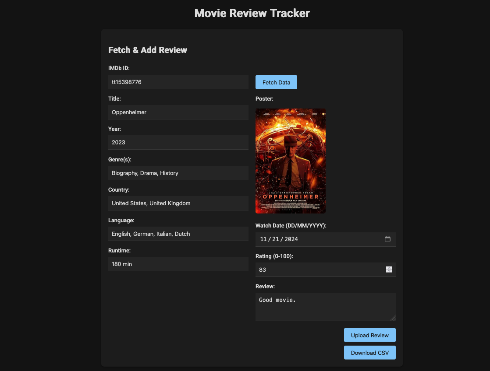

# Movie Review Tracker

Welcome to **Movie Review Tracker**, a sleek, dark-themed web application designed to help movie enthusiasts fetch movie details, log personal reviews, and manage them in a downloadable CSV file. Built with HTML, CSS, JavaScript, and a touch of PHP, this tool combines a modern Material Design aesthetic with practical functionality.

## Features

- **Fetch Movie Data**: Enter an IMDb ID (e.g., `tt1375666` for *Inception*) to instantly pull movie details like title, year, genre, country, language, runtime, and poster from the OMDB API.
- **Add Reviews**: Rate movies (0-100), write reviews, and record watch dates, all stored locally and synced to a CSV file.
- **Interactive Display**: View your reviews in collapsible cards with country flags, color-coded ratings, and edit/delete options.
- **Downloadable CSV**: Export your reviews as a `movie_reviews.csv` file for backups or external use.
- **Dark Theme**: A stylish, eye-friendly Material Design interface with smooth animations and responsive layout.

## Screenshots

  
*The "Fetch & Add Review" form where you input IMDb IDs and review details.*

  
*The "Your Reviews" section displaying your movie reviews with ratings and actions.*

## Prerequisites

- A web server with PHP support (e.g., XAMPP, MAMP, or PHP’s built-in server).
- An [OMDB API key](http://www.omdbapi.com/apikey.aspx) (free tier available).

## Setup Instructions

1. **Clone or Download**
   ```bash
   git clone https://github.com/phyvics/movie-review-tracker.git
   cd movie-review-tracker